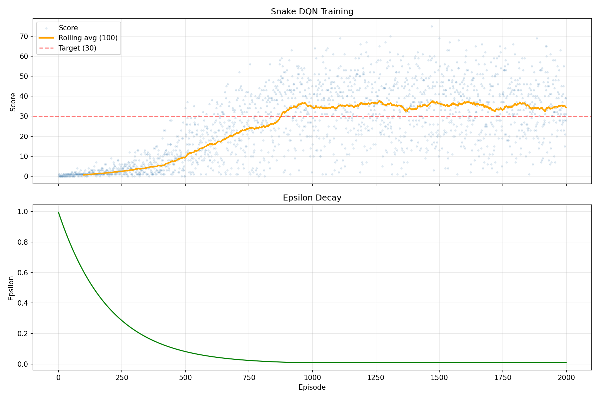

# DeepSnake - Snake DQN Reinforcement Learning

A Snake game agent trained with Deep Q-Learning (DQN) using PyTorch. The agent learns from scratch to play Snake, averaging 44+ points over 200 evaluation games. Hyperparameters and architecture were tuned via automated experiment sweeps (autoresearch).

## Results

- **Average score (200 games):** 44.36
- **Best single game:** 75
- **Games scoring 30+:** 88%

*Improved from baseline avg 33.18 through 47 automated experiments (autoresearch).*



## Tech Stack

- Python 3.10+
- PyTorch (neural network)
- Pygame (visualization)
- NumPy
- Matplotlib (training plots)

## Project Structure

```
snake_dqn/
├── snake_env.py      # Headless Snake game environment (READ-ONLY)
├── model.py          # DQN neural network (512-256-128)
├── agent.py          # Double DQN agent with replay buffer
├── train.py          # Training loop (1000 episodes)
├── evaluate.py       # Headless evaluation over 200 games
├── play.py           # Pygame visualization of trained agent
├── plot_training.py  # Plot training curves
└── checkpoints/      # Saved model weights
results.tsv           # Full autoresearch experiment log (47 experiments)
```

## Quick Start

### Install dependencies

```bash
pip install torch numpy pygame matplotlib
```

### Watch the trained agent play

```bash
cd snake_dqn
python play.py
```

**Controls:**
- `SPACE` - pause/unpause
- `R` - reset game
- `Q` - quit

### Train from scratch

```bash
cd snake_dqn
python train.py
```

Training runs for 1000 episodes and saves checkpoints to `checkpoints/`.

### Generate training plots

```bash
cd snake_dqn
python plot_training.py
```

## How It Works

### Environment

- 20x20 grid, snake starts at center (length 3, moving right)
- Actions are relative: straight, turn right, turn left
- Reward: +10 eat food, -10 die, +1/-1 move closer/farther from food

### State Representation (24 features)

- Immediate danger in 3 directions (straight, right, left)
- Current direction (one-hot, 4 values)
- Food direction (4 binary values)
- Normalized head position (x, y)
- Normalized food offset (dx, dy)
- Snake length (normalized)
- Distance to nearest obstacle in 8 directions (raycasting)

### DQN Improvements

| Technique | Purpose |
|---|---|
| Double DQN | Reduces Q-value overestimation |
| Huber loss (SmoothL1) | Stabilizes training vs MSE |
| Soft target updates (tau=0.005) | Smoother learning than hard copies |
| Gradient clipping (max_norm=1.0) | Prevents gradient explosion |
| Linear epsilon decay (over 70% of episodes) | Better exploration schedule than multiplicative decay |
| Larger batch size (128) | More stable gradient estimates |

### Network Architecture

```
Input(24) → Linear(512) → ReLU → Linear(256) → ReLU → Linear(128) → ReLU → Linear(3)
```

### Autoresearch Results

47 experiments were run automatically using the [Karpathy autoresearch](https://github.com/karpathy/autoresearch) pattern: modify code, train, evaluate over 200 greedy games, keep improvements, discard failures, repeat. Each experiment was committed, evaluated, and either kept or reverted.

**Improvements kept (cumulative):**

| # | Experiment | avg_score | Delta |
|---|---|---|---|
| 0 | Baseline (original code) | 33.18 | -- |
| 1 | Linear epsilon decay (80%) | 39.10 | +5.92 |
| 2 | Batch size 64 → 128 | 40.99 | +1.89 |
| 3 | Wider network (512-256-128) | 42.66 | +1.67 |
| 4 | Epsilon decay tuned to 70% | 43.66 | +1.00 |
| 5 | 1000 episodes + correct schedule | 44.36 | +0.70 |

**Total improvement: +11.18 avg_score (+34%)**

Notable failed experiments include: dueling DQN, prioritized experience replay, n-step returns, reward clipping/scaling, cosine LR annealing, LayerNorm, dropout, GELU/SiLU activations, and various learning rate reductions. See `results.tsv` for the full log of all 47 experiments.

### Evaluate a trained model

```bash
cd snake_dqn
python evaluate.py
```

Runs 200 headless games and prints avg_score, median, best, and percentage scoring 30+.
